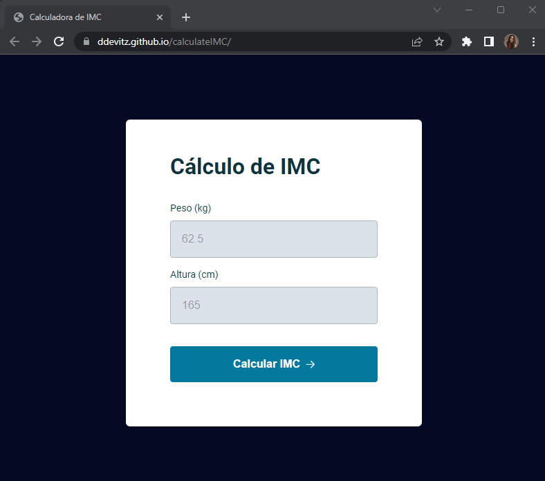
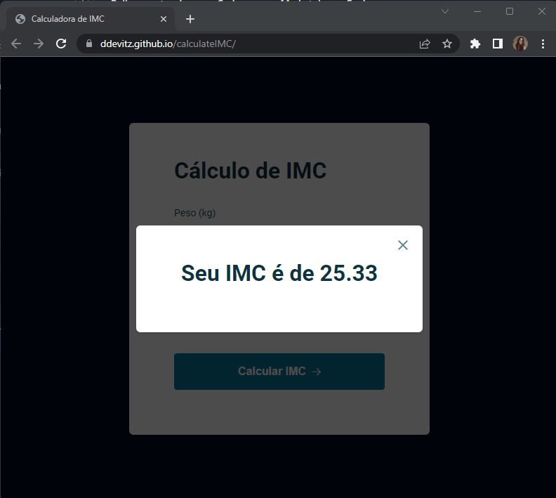

# Calculadora IMC

Criamos em aula uma calculadora de IMC, onde vocÊ adiciona os valores e o resultado pode ser visto tando clincado em calcular como clicando na tela "Enter". Este exercício foi proposto para praticarmos os testes de lógica de programação.

## Screenshots

Tela inicial:

Após adicionar os valores e clicar em calcular:

